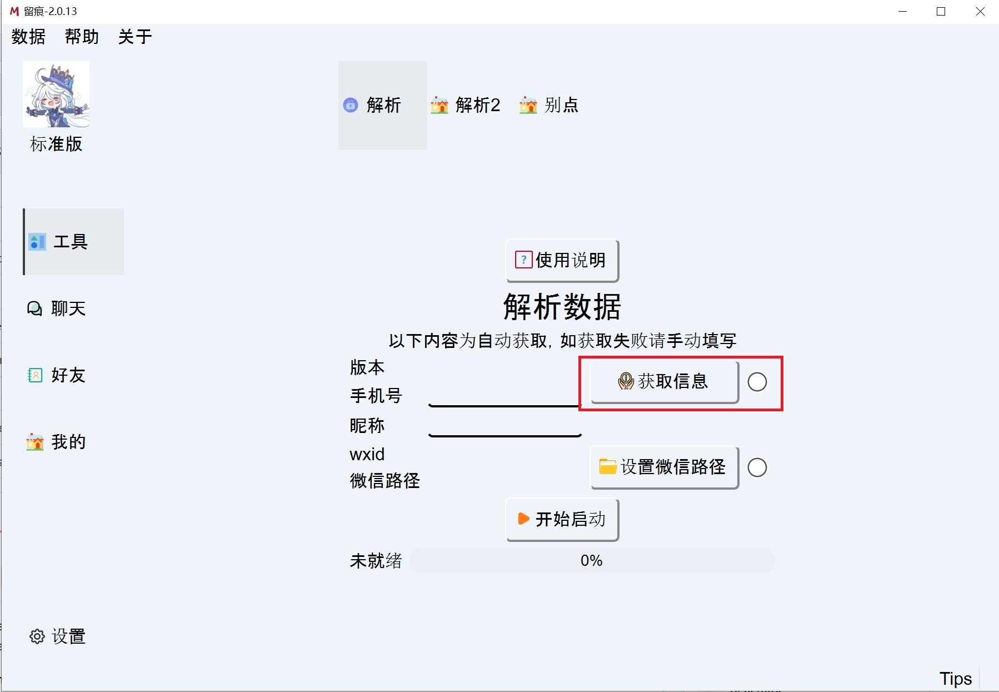
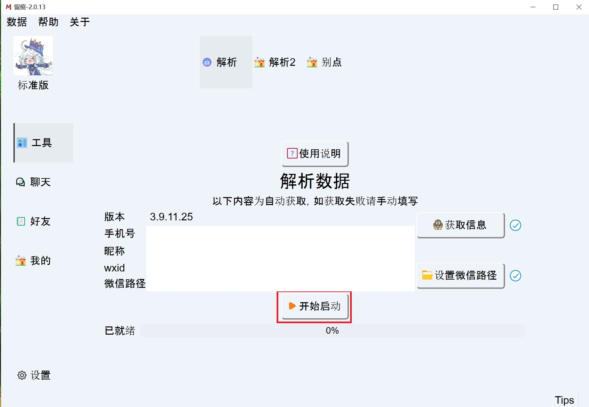
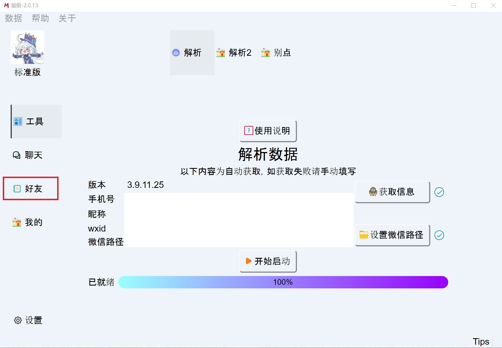
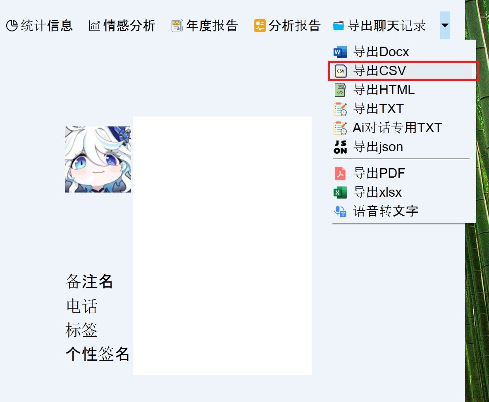

# WeClone-WeChatMsg

This repository is forked from https://github.com/xming521/WeClone. The only difference is that we add support for datasets extracted from [WeChatMsg](https://github.com/LC044/WeChatMsg/tree/master), and optimizes the data preprocessing to enhance the data quality.

To tune the LLM model with your chat history, firstly download [MemoTrace](https://memotrace.cn/). Log in to WeChat PC and migrate your WeChat data to it. Then export your chat histories to CSV files, and follow the same procedure as instructed in WeClone repository to train the model.

Please note that this repository is only for personal use. Do not copy or share.

# Steps to run
1. Migrate your WeChat data to your PC;
2. Export your chat history to a .csv file through [MemoTrace](https://memotrace.cn/);
3. Create a directory "data/csv/chat" and place the exported .csv file to the directory;
4. Install the required python packages by ``pip install -r requirements``;
5. Run ``python make_dataset/csv_to_json.py`` to convert the dataset to a json file;
6. Revise ``default_prompt`` in "src/template.py" to provide an identity for the model;
7. Run ``python src/train_sft.py`` to train the model (if you are in China mainland, you may want to download the model from ModelScope instead of HuggingFace; then you need to set ``model_name_or_path`` to ``ZhipuAI/chatglm3-6b`` in "settings.json" and modify the environment variable by ``export USE_MODELSCOPE_HUB=1``);
8. Run ``python src/web_demo.py`` to launch the chatbot.

# How to export your chat history through MemoTrace
</img>
</img>
</img>
</img>